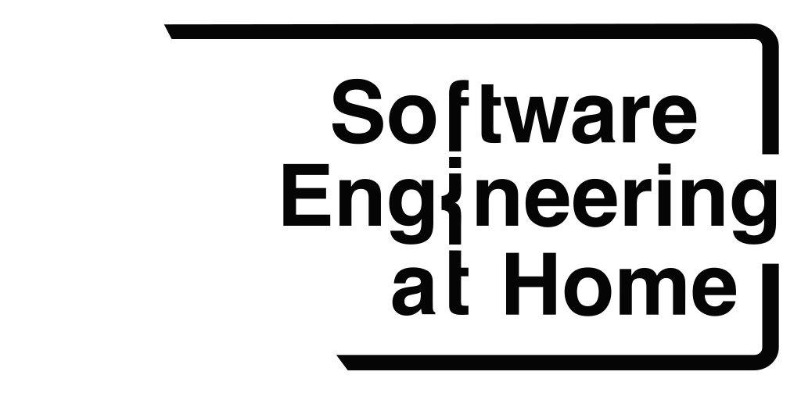

# Branding for Software Engineering at Home

Branding for the Software Engineering at Home organisation - for use on places such as GitHub, Twitter, and YouTube.

## Colour Palette

| Primary | Secondary | Tertiary | Light | Dark |
| - | - | - | - | - |
|  |  |  |  |  |

## Graphics

### Logo

Main brand logo in multi-colour; making use of the main colour palette - for use on dark and light backgrounds. To be used in title slides and banners where there's space to advertise the full brand name.

| Size | Graphic (SVG) |
| - | - |
| 512x256px |  |
| 256x128px |  |

### Monochrome Logo

Monochrome versions of the brand logo, to stand out on mixed colour backgrounds where contrast is difficult to acheive with the multi-colour logo.

| Size | Graphic (SVG) White | Graphic (SVG) Black |
| - | - | - |
| 512x256px |  |  |
| 256x128px |  |  |

### Icon

Square brand icon in multi-colour; designed to be cropped into a circular icon for placement in social media avatars and other hint locations where the full brand logo cannot be displayed. This version is without a background so it can be rendered into HTML pages or other assets dynamically.

| Size | Graphic (SVG) |
| - | - |
| 256px |  |
| 128px |  |
| 64px |  |
| 32px |  |
| 16px |  |

### Monochrome Icon

Monochrome versions of the brand icon, to stand out on mixed colour backgrounds where contrast is difficult to acheive with the multi-colour logo. For example; to create a video watermark.

| Size | Graphic (SVG) White | Graphic (SVG) Black |
| - | - | - |
| 256px |  |  |
| 128px |  |  |
| 64px |  |  |
| 32px |  |  |
| 16px |  |  |

### Icon with background

Multi-colour version of the brand icon; rendered with a dark background and exported as a PNG so that it can be directly uploaded to social media without having to convert the SVG.

| Size | Graphic (PNG) |
| - | - |
| 256px | |
| 128px | |
| 64px | |
| 32px | |
| 16px | |

## Social Media Banners

The main banner for the brand combining the brand logo and relevant photography; for use on title slides and banners.

| Size | Graphic (PNG) |
| - | - |
| 512x256px | |


## Use of fonts

CSS provided as guidance for correct use of fonts.

```css

@import url(https://fonts.googleapis.com/css?family=Open+Sans);
@import url(https://fonts.googleapis.com/css?family=Ubuntu+Mono);

h1, h2, h3, h4, h5 {
  font-family: Helvetica, 'Open Sans', sans-serif;
}

html, body { font-family: 'Ubuntu Mono', monospace; }
```