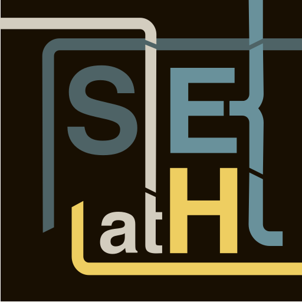

# Branding for Software Engineering at Home

Branding for the Software Engineering at Home organisation - for use on places such as GitHub, Twitter, and YouTube.

## Colour Palette

| Primary | Secondary | Tertiary | Light | Dark |
| - | - | - | - | - |
|  |  |  |  |  |

## Graphics

### Logo

| Size | Graphic (SVG) |
| - | - |
| 512x256px |  |
| 256x128px |  |

### Monochrome Logo

| Size | Graphic (SVG) |
| - | - |
| 512x256px |  |
| 256x128px |  |

### Icon

| Size | Graphic (SVG) |
| - | - |
| 256px |  |
| 128px |  |
| 64px |  |
| 32px |  |
| 16px |  |

### Monochrome Icon

| Size | Graphic (SVG) |
| - | - |
| 256px |  |
| 128px |  |
| 64px |  |
| 32px |  |
| 16px |  |

### Icon with background

| Size | Graphic (PNG) |
| - | - |
| 256px | |
| 128px | |
| 64px | |
| 32px | |
| 16px | |

## Social Media Banners

| Size | Graphic (PNG) |
| - | - |
| 512x256px | |


## Use of fonts

```css
html, body {
  font-family: Helvetica, sans-serif;
}
```